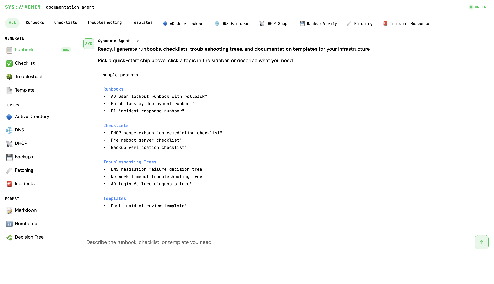
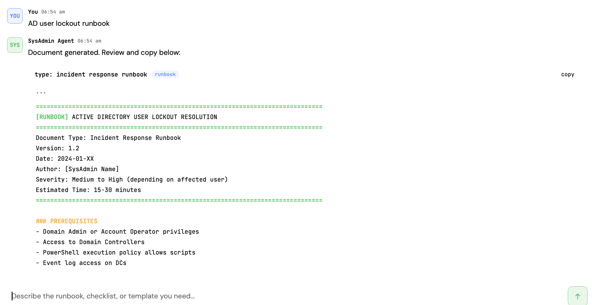
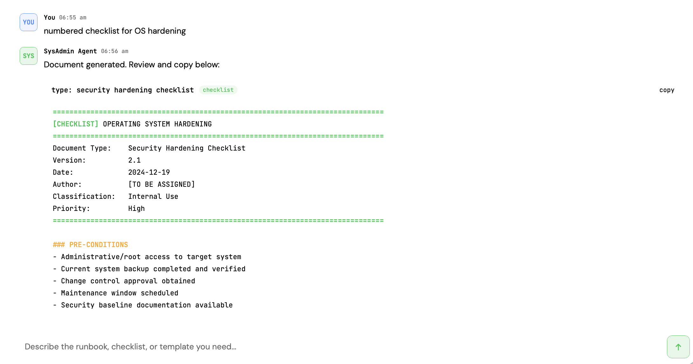
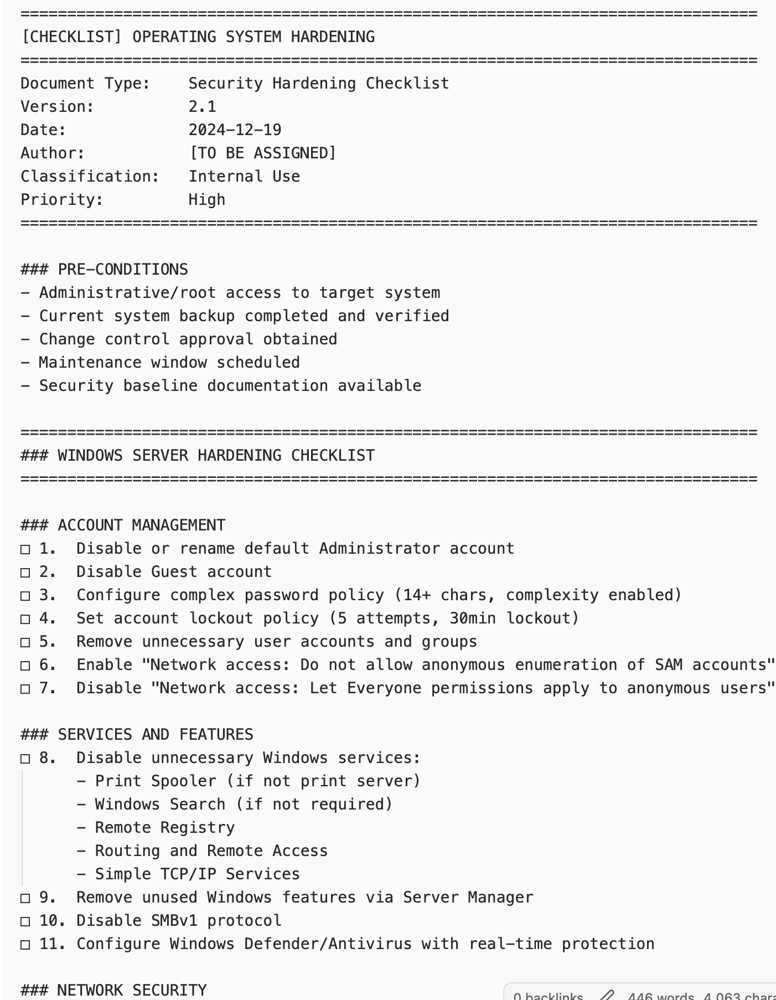
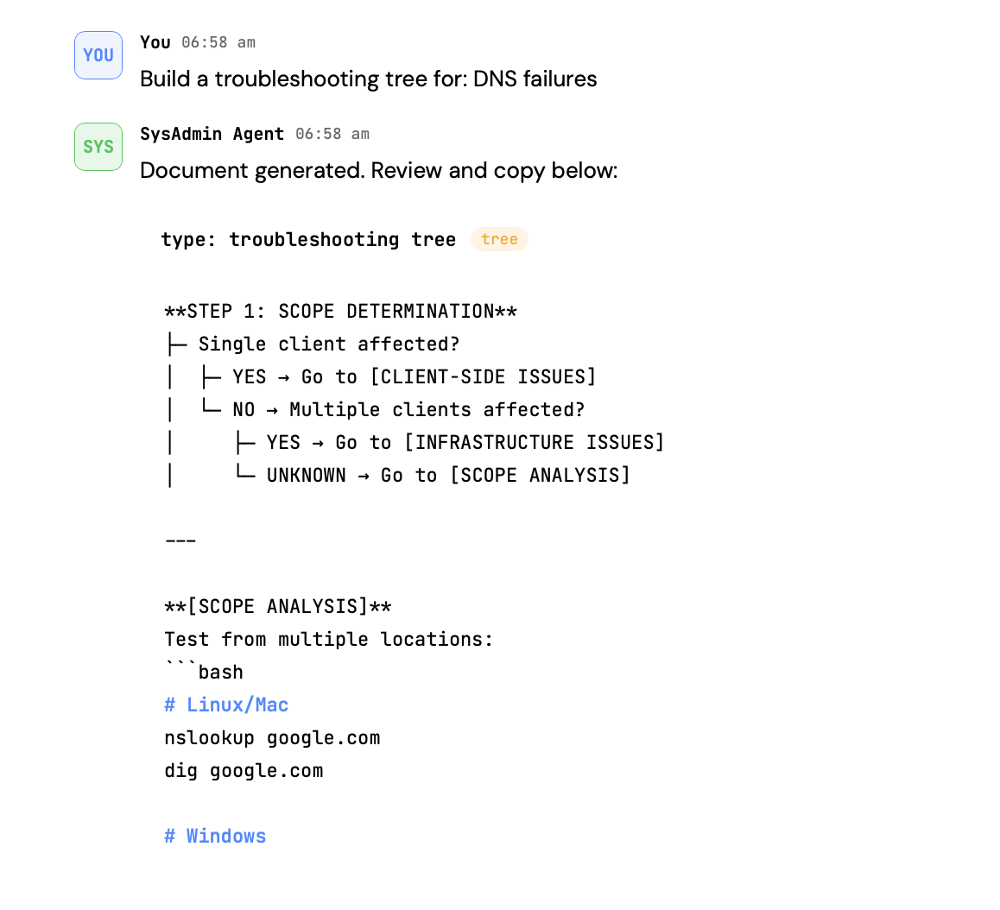

# SysAdmin Documentation Agent

> AI-powered infrastructure documentation generator. Runbooks, checklists, troubleshooting trees, and templates — on demand.

Built with [Claude](https://claude.ai) by Anthropic.


---

## What It Does

Describe what you need. Get a structured, production-ready document in seconds.

**Document types:**
- **Runbooks** — step-by-step procedures with prerequisites, commands, rollback, and verification
- **Checklists** — ordered task lists with pass/fail criteria
- **Troubleshooting Trees** — IF/THEN/ELSE decision logic for diagnosing failures
- **Templates** — blank-fill frameworks for incidents, change requests, handoffs

**Domains covered:**

| Domain | Examples |
|---|---|
| Active Directory | User lockout, password reset, GPO rollout, OU restructure |
| DNS | Resolution failures, zone delegation, record propagation |
| DHCP | Scope exhaustion, lease audit, failover config |
| Backups | Verification, restoration, retention review |
| Patching | Patch Tuesday, emergency CVE, rollback procedure |
| Incident Response | P1/P2 triage, post-mortem, escalation tree |

---

## Screenshots

**The agent UI**



**Generating a runbook**



**Hardening checklist**





**Troubleshooting tree**




**Note:** The header section can be edited in the const SYSTEM_PROMPT = `...` section of the html file. 
Look for "- Always start with a header block: document type, title, version, date, author placeholder, severity/priority if applicable" and add variables that you want. 
EG

- Always start with every document with this exact header block:
  Organisation: Acme IT
  Document Type: [document type]
  Title: [document title]
  Version: 1.0
  Date: [today's date]
  Author: [leave blank]
  Reviewed By: [leave blank]
  Classification: Internal

  
---

## Setup

### Prerequisites
- [Node.js](https://nodejs.org) v18 or higher
- An Anthropic API key — get one at [console.anthropic.com](https://console.anthropic.com)

### Install

```bash
git clone https://github.com/YOUR_USERNAME/sysadmin-agent.git
cd sysadmin-agent
npm install
```

### Configure

```bash
cp .env.example .env
```

Open `.env` and add your API key:

```
ANTHROPIC_API_KEY=sk-ant-your-key-here
```

> **Never commit your `.env` file.** It is already in `.gitignore`. The `.env.example` file (which contains no real key) is safe to commit and is included as a template for other users.

### Run

```bash
npm start
```

Open [http://localhost:3000](http://localhost:3000) in your browser.

> **Note:** go to `http://localhost:3000` directly — not `http://localhost:3000/sysadmin-agent.html`. The root route serves the app automatically.

---

## How the API Key Is Protected

Requests from the browser go to `/api/chat` on the local Express server — not directly to Anthropic. The server reads the key from `.env` and attaches it before forwarding the request. **The key never appears in the browser or in any file that gets committed to Git.**

```
Browser → /api/chat → server.js (attaches key from .env) → Anthropic API
```

---

## Project Structure

```
sysadmin-agent/
├── README.md
├── server.js                     ← Express proxy server (keeps API key server-side)
├── package.json
├── .env.example                  ← copy to .env and add your key
├── .gitignore                    ← .env and node_modules excluded
├── GUI_Example.png
├── MainPage_Example.png
├── Runbook_PromptExample.png
├── Hardening_PromptExample.png
├── Hardening_ChecklistExample.png
├── TroubleshootingTree_PromptExample.png
├── agent/
│   └── sysadmin-agent.html       ← the UI (calls /api/chat, not Anthropic directly)
├── docs/
│   ├── USAGE.md
│   ├── ARCHITECTURE.md
│   └── DEMO_VIDEO_SCRIPT.md
└── prompts/
    ├── SAMPLE_PROMPTS.md         ← 60+ ready-to-use prompts
    └── SYSTEM_PROMPT.md          ← the system prompt, easy to customise
```

---

## Customising

The agent's behaviour is controlled by the `SYSTEM_PROMPT` constant in `agent/sysadmin-agent.html`. Add your environment context:

```
Our environment: Windows Server 2022, AD forest acme.local,
Azure AD Connect sync every 30 min, Veeam B&R for backups,
WSUS for patching. Tickets in ServiceNow format INC0000000.
All PowerShell examples should target PS 7.
```

For longer documents, increase `max_tokens` in the same file:

```javascript
max_tokens: 2000,  // or 4000 for very detailed runbooks
```

---

## Contributing

PRs welcome. Good first contributions:
- New domain coverage (VMware, Azure, Kubernetes)
- Additional sample prompts
- Persistent document history via browser storage
- Export to PDF or DOCX

---

## License

MIT
